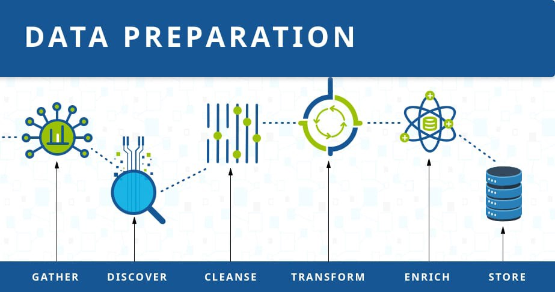

# 00. Dealing with Outliers
In statistics, an outlier is a data point that differs significantly from other observations. An outlier may be due to variability in the measurement or it may indicate experimental error; the latter are sometimes excluded from the data set. An outlier can cause serious problems in statistical analyses.

Remember that even if a data point is an outlier, it's still a data point! Carefully consider your data, its sources, and your goals whenever deciding to remove an outlier. Each case is different!
### Useful Links (How to deal with outliers?)
1. https://machinelearningmastery.com/how-to-identify-outliers-in-your-data/
2. https://machinelearningmastery.com/how-to-use-statistics-to-identify-outliers-in-data/
3. https://machinelearningmastery.com/how-to-use-statistics-to-identify-outliers-in-data/

# 01 Dealing with data Leakage 
# 02 Dealing with missing data
# 03 Dealing with categorical data

# Usefull Links
1. Framework for Data Preparation Techniques in Machine Learning;
https://machinelearningmastery.com/framework-for-data-preparation-for-machine-learning/ & https://medium.com/manomano-tech/a-framework-for-feature-engineering-and-machine-learning-pipelines-ddb53867a420.

2. How to Perform Data Cleaning for Machine Learning with Python?
https://machinelearningmastery.com/basic-data-cleaning-for-machine-learning/ &
https://machinelearningmastery.com/data-cleaning-turn-messy-data-into-tidy-data/

3. How to Choose a Feature Selection Method For Machine Learning? 
https://machinelearningmastery.com/feature-selection-with-real-and-categorical-data/
https://www.linkedin.com/pulse/feature-engineering-techniques-machine-learning-sunil-kumar-cheruku/

5. Feature_selection for Regression Problems;
https://towardsdatascience.com/how-to-perform-feature-selection-for-regression-problems-c928e527bbfa &
https://machinelearningmastery.com/discover-feature-engineering-how-to-engineer-features-and-how-to-get-good-at-it/

6. How to Use StandardScaler and MinMaxScaler Transforms in Python?
https://machinelearningmastery.com/standardscaler-and-minmaxscaler-transforms-in-python/

7. How to Perform Feature Selection with Categorical Data;
https://machinelearningmastery.com/feature-selection-with-categorical-data/

8. How to Perform Feature Selection With Numerical Input Data;
https://machinelearningmastery.com/feature-selection-with-numerical-input-data/

9. How to extract features from the encoded layer of an autoencoder? 
https://datascience.stackexchange.com/questions/64412/how-to-extract-features-from-the-encoded-layer-of-an-autoencoder &
https://medium.com/@venkatakrishna.jonnalagadda/sparse-stacked-and-variational-autoencoder-efe5bfe73b64

10. A Gentle Introduction to K-fold Cross-Validation
https://machinelearningmastery.com/k-fold-cross-validation/

11. A Gentle Introduction to Activation Regularization in Deep Learning
https://machinelearningmastery.com/activation-regularization-for-reducing-generalization-error-in-deep-learning-neural-networks/

12. How to Identify Overfitting Machine Learning Models in Scikit-Learn
https://machinelearningmastery.com/overfitting-machine-learning-models/

13. How to Perform Data Cleaning for Machine Learning with Python
https://machinelearningmastery.com/basic-data-cleaning-for-machine-learning/

14. Navigating The Hell of NaNs in Python
https://towardsdatascience.com/navigating-the-hell-of-nans-in-python-71b12558895b

15. Merge, join, concatenate in Python
https://pandas.pydata.org/pandas-docs/stable/user_guide/merging.html

16. Melt function in Python is used to unpivot a given DataFrame from a wide format to a long format.
https://pandas.pydata.org/docs/reference/api/pandas.melt.html & https://www.w3resource.com/pandas/dataframe/dataframe-melt.php

17. How to Map Data to a Normal Distribution\
[How to Transform Data to Better Fit The Normal Distribution](https://machinelearningmastery.com/how-to-transform-data-to-fit-the-normal-distribution/)\
[Map Data to a Normal Distribution](https://scikit-learn.org/stable/auto_examples/preprocessing/plot_map_data_to_normal.html)

